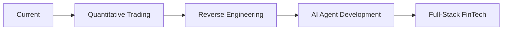

<div align="center">

# 👋 Hi there, I'm yutian12530a

### 🦊 A Developer passionate about AI Automation & Financial Technology


</div>

---

## 🚀 About Me

```yaml
name: yutian12530a
location: Asia/Bangkok 🇹🇭
current_focus: AI Automation & FinTech
hobbies: Coding, Trading, Security Research
```

- 🔭 Currently building **OpenClaw** automation systems
- 🌱 Learning **Quantitative Trading** & **Reverse Engineering**
- 💬 Ask me about **Python, JavaScript, AI Agents**
- ⚡ Fun fact: I code with my fox assistant 🦊

---

## 🛠️ Tech Stack

<table>
<tr>
<td valign="top" width="50%">

### Languages


### Frontend


</td>
<td valign="top" width="50%">

### Backend


### DevOps & Tools


</td>
</tr>
</table>

---

## 📊 GitHub Stats

<div align="center">


</div>

---

## 🎯 Current Projects

| Project | Description | Status |
|---------|-------------|--------|
| [**OpenClaw Automation**](https://github.com/yutian12530a) | AI-powered personal assistant system | 🚀 Active |
| [**Quant Trading Bot**](https://github.com/yutian12530a) | Automated trading strategies | 🔧 In Progress |
| [**Security Toolkit**](https://github.com/yutian12530a) | Reverse engineering tools | 📚 Learning |

---

## 🌱 Learning Roadmap



- ✅ Python & JavaScript Mastery
- 🔄 Machine Learning for Trading
- 📖 x86/x64 Assembly
- 📖 Binary Exploitation
- 📌 Distributed Systems

---

## 📫 Connect With Me

<div align="center">

[](https://t.me/My_KK_OpenClaw_Bot)
[](https://github.com/yutian12530a)
[](mailto:your-email@example.com)

</div>

---

## 💻 Contribution Graph

<div align="center">


</div>

---

<div align="center">

### 🦊 "Code with curiosity, build with passion"


</div>
